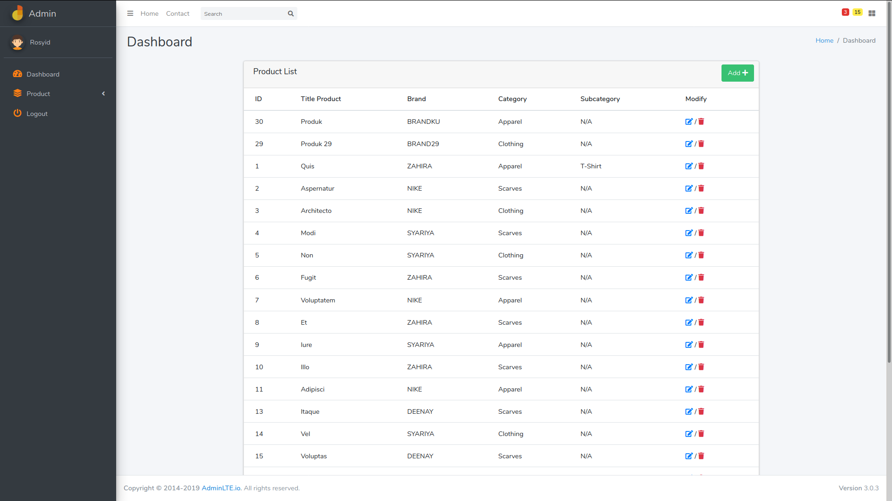
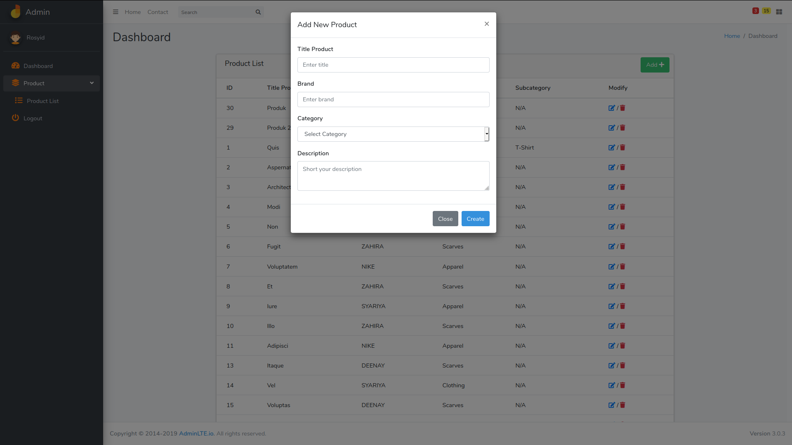

## Test BE

## Preview




## Technology

- [Laravel 7](https://laravel.com/)
- [NPM 6.14.5](https://www.npmjs.com/)
- [Vue 2](https://vuejs.org/)
- [Router Vue](https://router.vuejs.org/)
- [Bootstrap 4](https://getbootstrap.com/)
- [Admin LTE 3](https://adminlte.io/)
- [Font Awesome](https://fontawesome.com/)
- [Vform](https://github.com/cretueusebiu/vform)
- [Vue Progress Bar](http://hilongjw.github.io/vue-progressbar/)
- [Sweet Alert 2](https://sweetalert2.github.io/)


## Implement
- Laravel Naming Conventions
- RESTful API
- History mode for Vue js
- Seeder and Factory (Dummny Data)
- Validation


## Features
- CRUD Product
- Admin Page


## Getting Started
- Download / Clone from github

- Set up your database in .env file

- Install composer
  ```
  composer install
  ```

- Generate Key
  ```
  php artisan key:generate
  ```
  
- run migration and seeding
  ```
  php artisan migrate:fresh --seed
  ```

- create new account  

- run NPM watch (if need)
  ```
  npm run watch
  ```


> NB
>
> Subcategory: defaulf is Null
>
> You can set up subcategory by manually or by update
